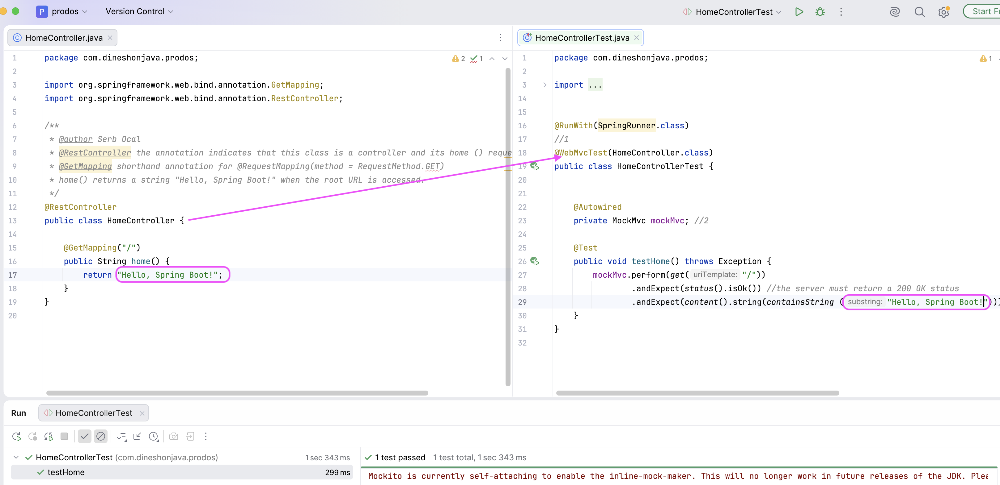
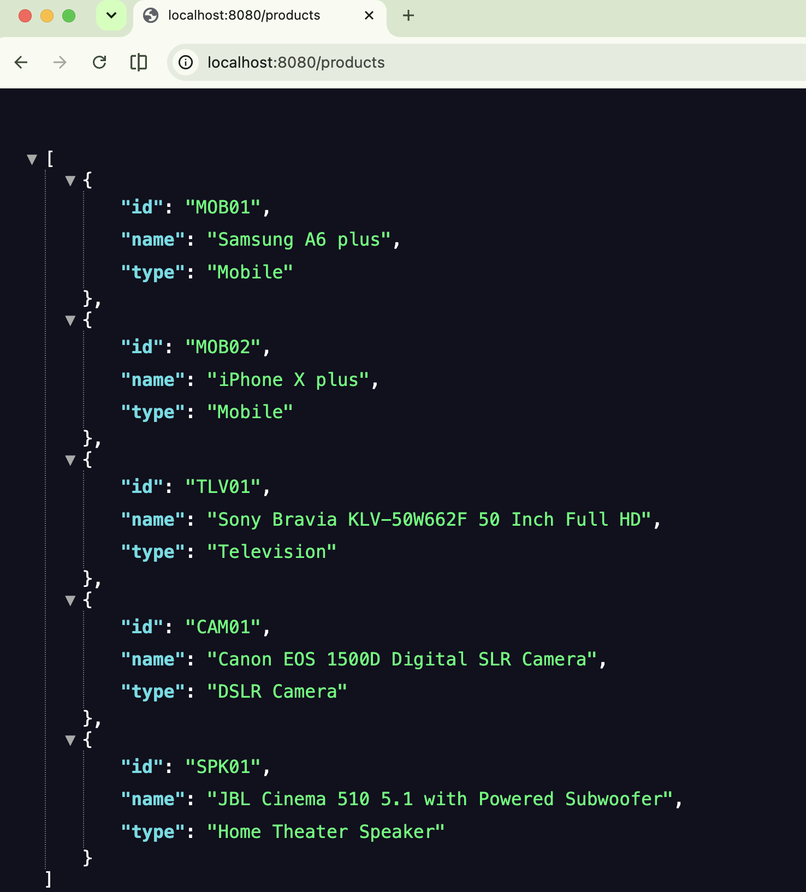

# esirgeyen ve bağışlayan❤️ Allah'ın (c.c) adıyla - 2a0_bpb_rajput
- `Spring Initializr` is used by creating a new project with `IntelliJ IDEA`

## Project Structure
- `pom.xml` build tool file has the bare minimum requirement for the `Spring Boot 4.1.0 application`
with the Spring MVC web module.
- `mvnw.cmd`is the wrapper script file 
- `ProdosApplication.java` bootstraps the SpringBoot project as the main application file
- `src\main\resoruces\application.properties` is the externalized autoconfiguration file. It can be a `application.yml` file as well
- `static` place any static content such as images, stylesheets, JavaScript. This content is served to the browser.
- `templates` used to place template files that will be used as the UI and render the content on the browser. 
- `ProdosApplicationTests.java` Junit test class file used to ensure the Spring application context is loaded successfully.
- `HomeController` is the RestController class
- `HomeControllerTest` is the testing class for the HomeController
  - `@WebMvcTest` is a special test annotation to test the Spring MVC flow instead of `@SpringBootTest`
                  registers the HomeController for testing
  - `MockMvc` this class is injected and provides a MockMvc object for testing
  - `testHome()` defines the test case
  
  
## Running instructions
- `mvn spring-boot:run`
  