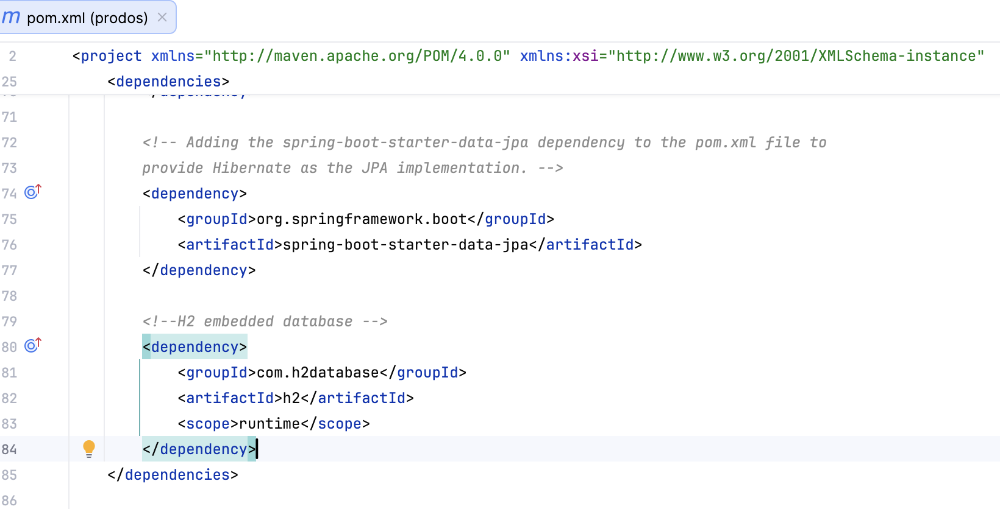
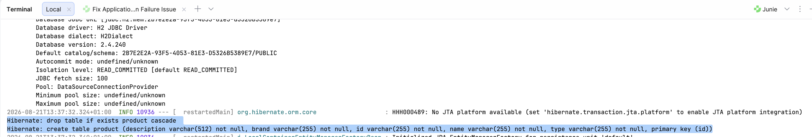
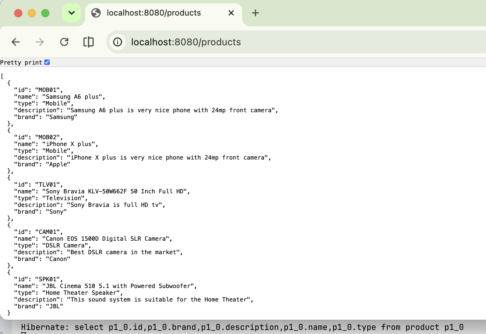
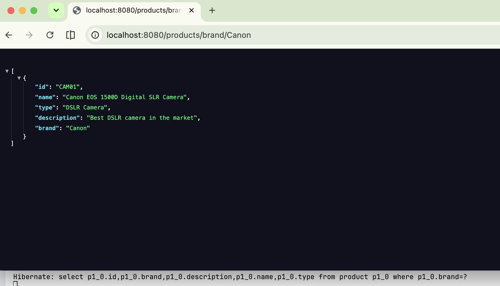
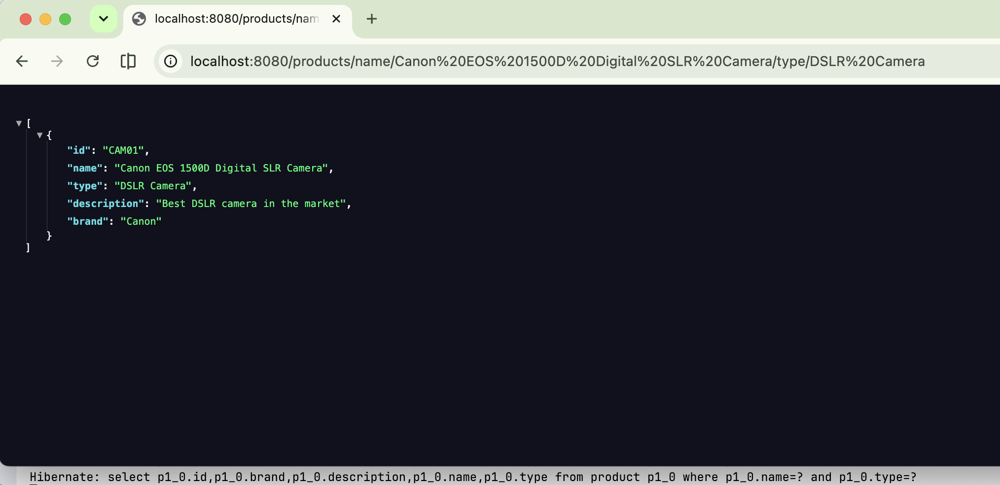
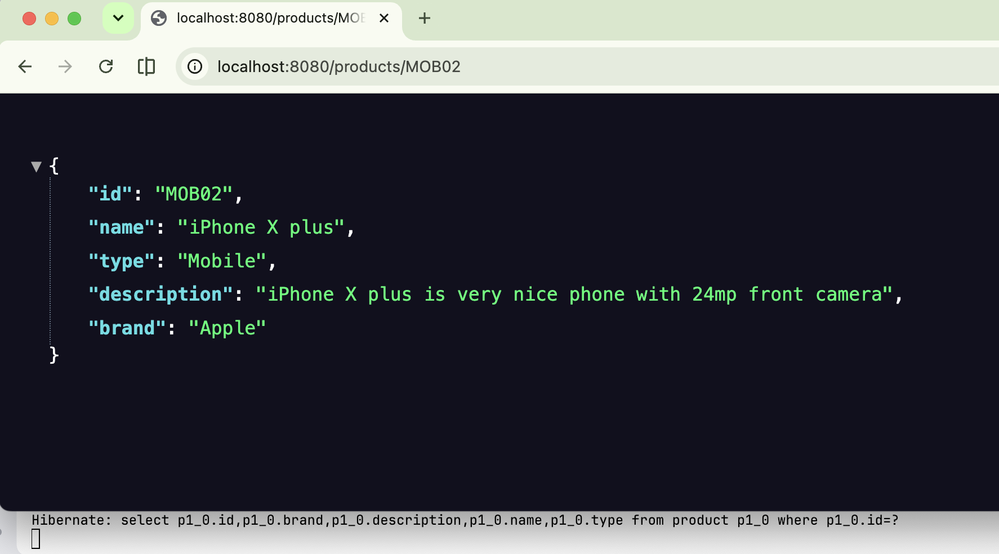

# esirgeyen ve bağışlayan❤️ Allah'ın (c.c) adıyla - 2a0_bpb_rajput
- `Spring Initializr` is used by creating a new project with `IntelliJ IDEA`

## Table of Contents
- [Configuring Data and CRUD Operations](configuring-data-and-crud-operations)
  - [A-JDBC](#a-jdbc)
  - [B-ORM Hibernate](#b-orm-hibernate)
  - [C-Spring Data JPA](#c-spring-data-jpa)
  
## Configuring Data and CRUD Operations
The Spring framework provides full support to use backend technologies 
- A - `JDBC access using JDBCTemplate` 
- B - `Object relational mapping (ORM)` solution technologies such as `Hibernate`. 
- C - `Spring Data Java Persistence API (JPA) ` is a framework that simplifies the process of working with databases in Spring applications. 
It creates Repository implementations from interfaces and generates queires from the method names

### A-JDBC

### B-ORM Hibernate
- Object-relational mapping (ORM) means mapping `Java Persistence Objects to the relational database tables`.
- It is a technique used to fetch and manipulate the data using the `object-oriented programming` paradigm.
- We `don't need to write SQL queries manually`, and Hibernate handles the mapping between Java objects and database tables.
- Hibernate is a popular ORM tool and the most popular JPA implementation.
- Adding the `spring-boot-starter-data-jpa` dependency to the pom.xml file to provide Hibernate as the JPA implementation.
- Using JPQL (Java Persistence Query Language) query

#### Hibernate Outputs
- 
- 
- 
- 
- 
- 
### C-Spring Data JPA