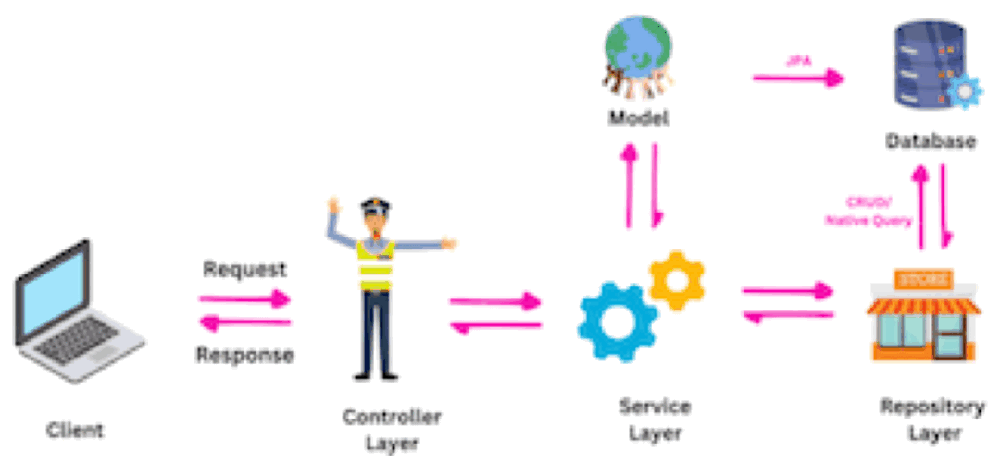
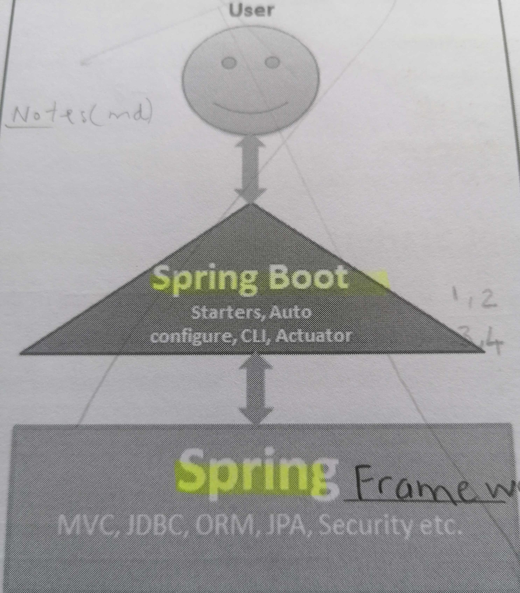
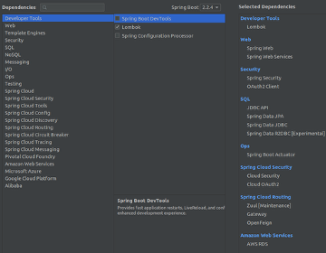
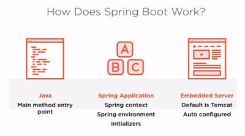
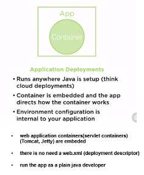
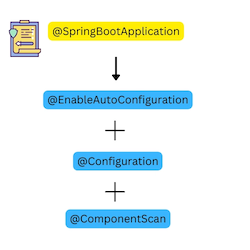
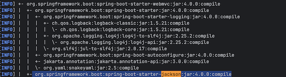

# esirgeyen ve bağışlayan❤️ Allah'ın (c.c) adıyla - 2

## Table of Contents
- [1_spring_boot_concept](#1_spring_boot_concept)
- [2_setup_spring_project](#2_setup_spring_project)
- [3_maven_dependencies](#3_maven_dependencies)
  - [3.1_maven_parent_overrides](#31_maven_parent_overrides)
- [4_application_info](#4_application_info)
- [5_running_instructions](#5_running_instructions)
- [6_annotations](#6_annotations)
- [7_test_driven_development_approach](#7_test_driven_development_approach)
- [8_data](#8_data)
  - [spring_sata_JPA_rrepositories](#spring_data_JPA_repositories)
  - [persistance_layer_repository](#persistance_layer_repository)
- [9_rest_secure](#9_rest_secure)
<!--###############################-->

# 1_spring_boot_concept

<!--###############################-->
Spring Boot is built on top of the existing Spring framework

- Four essential key components of SpringBoot are:
  - **Starters** are dependency descriptors in the pom.xml (e.g for Spring MVC we add spring-boot-starter-webmvc). Version of the
    starters in the Spring Boot application is managed by the Spring Boot starter parent POM in the Maven build application.                                   
     - `spring-boot-starter-test` is used to write `unit and integration tests`
     - `spring-boot-starter-security` is used for `authentication and authorization`
     - `spring-boot-starter-data-jpa` is used for  `Spring Data JPA with Hibernate`

  - **Auto Configuration** Spring Boot automatically configures the embedded Tomcat server and the beans in the Spring application context
  - **CLI** 
  - **Actuator** provides  metrics, health checks

- SpringBoot is on top of the Spring Framework with some auto-configuration for modules(`such as Spring MVC, Security, JDBC, JPA` ) based on the libraries available on the classpath of the Spring application.

# 2_setup_spring_project
- Manual, CLI and Spring Boot Initializer

## spring_boot_initializer
https://start.spring.io/

## cli
install the Spring Boot CLI by using the following commands:

```
brew tap spring-io/tap
brew install spring-boot
spring --version
```
### creates_maven_project
- `` mvn archetype:generate -DgroupId=microservices.book -DartifactId=social-multiplication -DarchetypeArtifactId=maven-archetype-quickstart -DinteractiveMode=true``

## next_steps
``unzip myproject.zip``
``cd myproject``
<!--###############################-->

# 3_maven_dependencies
- ``mvn dependency:tree``

  

## 3.1_maven_parent_overrides
Due to Maven's design, elements are inherited from the parent POM to the project POM.
While most of the inheritance is fine, it also inherits unwanted elements like `<license>` and `<developers>` from the parent.
<!--###############################-->

# 4_application_info
The ``Spring Boot SpringApplication class`` is a central component of the Spring Boot framework.
It is used to bootstrap and launch a Spring application from a Java main method.
The SpringApplication class automatically performs a number of tasks including, as @SpringBootApplication  annotation states

- Creating an ApplicationContext instance
- Scanning for configuration classes
  
- To use the SpringApplication class, I need to create an instance of it and call the run() method.

  
<!--###############################-->

# 5_running_instructions
- mvn <PHASE>
       - clean 
       - validate 
       - verify
       - compile

- `mvn help:describe -Dcmd=compile` lists all goals bound to a speicific phase

- ``mvn clean install``
- running particular tests: `` mvn -Dtest=MultiplicationServiceTest test``
                            ``mvn -Dtest=RandomGeneratorServiceImplTest test``
- running full suite of tests:  ``mvn test``               
- skip compiling tests: `` mvn clean install -DskipTests``
- ``mvn spring-boot:run``
- ``Ctrl + C`` stop the application
<!--###############################-->

# 6_annotations
- ``@Override`` Overriding of a method is done in a subclass ``package com.student.annotations.override.Dog.java``; when I define a method with the same signature as in superclass. ```package com.student.annotations.override.Animal.java`` Methods <b>toString, equals, and hashCode</b> are overridden quite often in subclasses.
 ``@Override`` prevents silent mistakes. If I try to remove the @Override line, the compiler won't warn me, and the method won't override anything. My program may still run, but it could behave unexpectedly because the intended method was never actually overridden.

- ``@SpringBootApplication`` annotation is a combination of ``@EnablAutoConfiguration,@Configuration, and @ComponentScan``
  - `@ComponentScan` enables component scanning in the Spring application. We can use the `@Component`, `@Controller`, `@Service`     
  

- ``@SpringBootTest``is used on the application test class. This annotation tells
`JUnit` to bootstrap the test with the Spring Boot features such as auto-configuration, beans creation, and so on.

- ``@RestController`` is used to return data, typically in JSON. It also includes ``@ResponseBody``  provides
  returning the data to be written directly to the body of the response by using  Jackson 2(Spring’s message converter)
  ``Jackson 2`` Spring’s message converters and it is on the classpath imported by ``spring-boot-starter-webmvc``
  
- ``@RequestMapping`` is a general-purpose annotation that can handle any HTTP method (GET, POST, PUT, DELETE, etc.)
  This annotation can be used both at the ``class and at the method level``
  There are also HTTP method specific shortcut variants such as @GetMapping, @PostMapping and @PutMapping, @DeleteMapping
- ``@GetMapping`` is a specialized annotation specifically for HTTP GET requests. (introduced in Spring 4.3)
- ``@Autowired``is used for automatic dependency injection. In simpler terms, it allows Spring to automatically
  wire the required beans into my classes. There are three main ways to inject my dependencies into my class:
  - Constructor, - Setter (Method), - Field injection
- ``@Data`` is a convenient shortcut annotation that bundles the features of ``@ToString , @EqualsAndHashCode , @Getter / @Setter and @RequiredArgsConstructor`` together: In other words, @Data generates all the boilerplate that
  is normally associated with simple POJOs (Plain Old Java Objects) and beans.
- ``@Slf4j:`` This is the most commonly used logging annotation for Spring Boot applications. When applied to a class,
  it automatically creates a static ``SLF4J logger instance named log``
- ``@Log:`` This annotation is used for applications relying on the ``java.util.logging framework``
- ``@Test`` This is the most important annotation which tells JUnit that the method is a test case.
- ``@ModelAttribute`` is an annotation that binds a method parameter or method return value to a named model attribute and then exposes it to a web view.
- Spring comes with a set of ``@Enable annotations`` that make it easier for developers to configure a Spring application. These annotations are used in conjunction with the ``@Configuration annotation``
``@EnableWebMvc`` is used for enabling Spring MVC in an application and works by importing the Spring MVC Configuration from WebMvcConfigurationSupport.

```
@Configuration
@EnableWebMvc
public class SpringMvcConfig implements WebMvcConfigurer
```
- ``@SuppressWarnings`` annotation is one of the ``three built-in annotations available in JDK`` and added alongside ``@Override and @Deprecated ``in Java 1.5. @SuppressWarnings instruct the compiler to ignore or suppress, specified compiler warning in annotated element and all program elements inside that element. 

- ``@Resource`` annotation is used to access and inject external resources, such as database connections or EJBs, into your application. the annotation facilitates resource management rather than file declaration
<!--###############################-->

# 7_test_driven_development_approach

## 7.1_stubs_mocks
Stub and Mock are dummy objects. ``Stub`` object is usually used for state verification, while ``mock`` object is
mostly used for behaviour verification. For example; using BDD (supported by MockitoBDD) defines
what should happen when XXXService is called. Please refer ``ID5``

### stubbing
a ``Stub`` is an object that simulates real objects with the minimum number of methods required for a test.
For example, if my class is dependent upon database, I can use ``HashMap`` to simulate database operation.
Stub object is mostly ``created by me`` and method is implemented in predetermined way, they mostly return hard coded values.
<!--###############################-->

# 8_data
## Spring_Data_JPA_Repositories
``CrudRepository`` provides CRUD functions
``JpaRepository`` provides JPA related methods such as flushing the persistence context and delete records in a batc
<!--###############################-->

# 9_rest_secure
In the web, there are two main ways to authenticate:
1.	With a username and password (also called basic authentication)
2.	With a secret token

- The secret token method includes `oAuth`, which lets the user to authenticate with social media networks like Github, Google, Twitter, Facebook, etc.

## Auth0
- I will rely on IAM platform like `Auth0` instead of building my own solution

- So many developers choose to build on an identity and access management platform instead of building their own solution from the ground up.

- User expectations, customer requirements, and compliance standards introduce significant technical challenges. With multiple user sources, authentication factors, and open industry standards, the amount of knowledge and work required to build a typical IAM system can be enormous. A strong IAM platform has built-in support for all identity providers and authentication factors, offers APIs for easy integration with your software, and relies on the most secure industry standards for authentication and authorization.

